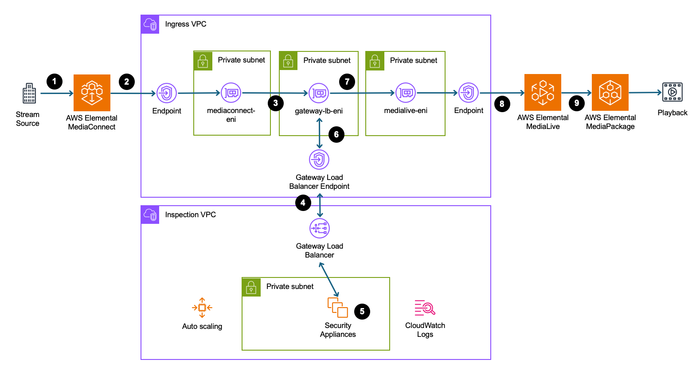

# Deep Packet Inspection for Securing High-Value Streaming Content in the Cloud

## The Business Challenge

The global live streaming market, valued at over $70 billion and growing at 28% annually, has become a critical revenue driver for media companies, broadcasters, and content creators. From premium sports broadcasts generating millions in advertising revenue to enterprise video communications handling sensitive corporate content, streaming infrastructure now carries business-critical and high-value data that demands enterprise-grade security.

Beyond traditional media companies, streaming has become essential infrastructure for businesses across every industry. Financial services firms conduct investor relations calls and earnings announcements that move markets, requiring secure, reliable delivery to thousands of stakeholders simultaneously. Healthcare customers depend on streaming for telemedicine consultations, medical training, and surgical broadcasts that handle sensitive patient data under strict HIPAA compliance requirements. Manufacturing companies use streaming for remote equipment monitoring, quality control inspections, and real-time collaboration between global facilities. Educational institutions deliver online learning, virtual conferences, and research presentations that represent significant intellectual property investments. Even retail customers leverage streaming for product launches, virtual shopping experiences, and customer support that directly impact sales and brand reputation. For these non-media businesses, streaming failures don't just affect viewer experience—they can result in regulatory violations, competitive disadvantage, operational disruptions, and direct revenue loss.

## Why Packet Inspection Matters for Live Streaming

Live streaming content faces unique security challenges that traditional network security solutions cannot address without compromising performance or creating coverage gaps. Enterprise compliance, regulatory requirements, corporate IT policies, and security posture demands require deeper packet inspection for live video ingestion and streaming workflows. For security-conscious workload environments, protecting live stream content is essential across networks you don't control. Traditional network security approaches fail for streaming workloads. Unlike web traffic that tolerates security-induced latency, live video streams require consistent, low-latency delivery to maintain viewer experience and prevent revenue loss. A single security bottleneck causes buffering, quality degradation, or stream interruptions that directly impact viewer engagement and business outcomes.

> **Important Note**: This comprehensive security inspection architecture is designed for specific enterprise use cases with stringent security requirements. Most streaming deployments do not require this level of packet-level inspection. This solution is primarily relevant for:
> 
> - **Highly regulated industries** (financial services, healthcare, government) with strict compliance requirements
> - **High-value content** (premium sports, confidential corporate communications) requiring maximum protection
> - **Security-conscious enterprises** with policies mandating comprehensive traffic inspection
> - **Customers handling sensitive data** where content integrity and audit trails are critical
> 
> Standard streaming deployments using AWS Media Services already include robust security features including encryption in transit, access controls, and network isolation that meet most security requirements without additional packet inspection.

### The Streaming Content Journey

The complex path that streaming content travels from source to audience reveals multiple security vulnerabilities that require specialized inspection capabilities. Video content begins at professional cameras where hardware encoders convert raw footage into Internet-friendly formats using advanced compression like H.265 or AV1, creating multiple quality levels for different network conditions and viewer devices.

Once encoded, streams get wrapped in specialized transport protocols designed for real-time delivery. Secure Reliable Transport (SRT) is the standard choice for professional broadcasting because it includes built-in error correction, encryption, and configurable buffering to balance latency against reliability.

These streams traverse multiple network segments: last-mile ISP networks with varying security standards, Internet backbone infrastructure managed by different customers, and content delivery networks before reaching AWS's global infrastructure. Each network hop represents a security boundary where content can be intercepted or modified.

### Security Vulnerabilities in the Streaming Pipeline

The real-time nature and performance requirements of streaming protocols create attack vectors that don't exist in traditional web applications, making specialized security inspection essential. SRT streams are hijacked when encryption keys are compromised, RTP streams are vulnerable to packet injection attacks where malicious actors insert unauthorized content, and control protocols like RTCP are spoofed to disrupt stream quality. The underlying UDP transport is susceptible to volumetric flooding attacks that overwhelm streaming infrastructure.

Attackers exploit the real-time nature of streaming to splice unauthorized content, advertisements, or malicious payloads directly into live streams. Quality degradation attacks deliberately corrupt video or audio to damage broadcaster reputation, while sophisticated attackers remove watermarks or inject AI-generated deepfake content into legitimate streams.

Streaming infrastructure becomes a high-value target because of its visibility and business impact. Attackers use streaming servers to amplify distributed denial-of-service attacks, intercept and modify streams during network transit, or redirect traffic through malicious infrastructure using BGP hijacking techniques. DNS poisoning attacks redirect viewers to fake streaming endpoints designed to steal credentials or distribute malware.

### Compliance and Regulatory Requirements

Modern streaming operations must meet stringent regulatory requirements that mandate comprehensive traffic inspection and detailed audit capabilities. Broadcasting operations need FCC compliance, financial services require SEC-compliant communications, healthcare customers must follow FDA guidelines, and government agencies require FISMA and FedRAMP compliance.

Comprehensive packet inspection is essential for meeting these requirements through detailed content handling logs, forensic analysis capabilities for incident response, automated compliance reporting, and technical validation of content integrity throughout the delivery process.

### Technical Inspection Requirements

Streaming security systems must balance comprehensive inspection capabilities with strict performance constraints. These systems must parse SRT, RTP, RTCP, and WebRTC protocols in real-time, examining video and audio payloads for anomalies while validating stream metadata, timestamps, and quality metrics.

Live streaming applications tolerate only small additional latency, far less than traditional security appliances. These systems must support multi-gigabit throughput for 4K and 8K content while maintaining consistent packet timing to prevent jitter and scaling dynamically to handle thousands of concurrent streams during peak events.

This complex security landscape demonstrates why traditional network security appliances cannot protect streaming workloads without significant performance compromises or security gaps.

## The Solution: Transparent Security with AWS Gateway Load Balancer

[AWS Gateway Load Balancer](https://aws.amazon.com/elasticloadbalancing/gateway-load-balancer/) eliminates the traditional trade-off between comprehensive security inspection and streaming performance through transparent, scalable architecture that delivers:

**100% Traffic Inspection** without compromising streaming performance through transparent packet-level security that adds low latency while maintaining full visibility into all streaming traffic.

**Elastic Security Scaling** that automatically adjusts inspection capacity based on streaming demand, ensuring consistent performance during peak events while optimizing costs during low-traffic periods.

**Enterprise-Grade Reliability** with multi-AZ deployment, automatic failover, and health monitoring that maintains streaming availability during security appliance failures.

**Seamless Integration** with existing AWS Media Services workflows, allowing customers to add comprehensive security inspection to current MediaConnect and MediaLive deployments without architectural changes.

The architecture provides immediate business value through reduced security risk, maintained streaming performance, simplified compliance reporting, and cost-effective scaling—enabling customers to protect their high-value streaming content without sacrificing the viewer experience that drives revenue.

**Implementation Resources**: The complete reference implementation, including AWS CDK code, security appliance configurations, and deployment automation, is available in our [GitHub repository](https://github.com/aws-samples/streaming-security-gateway-load-balancer). The repository includes step-by-step deployment guides, configuration examples, and operational utilities for managing the streaming security architecture.

## The AWS Media Services Foundation

[AWS Media Services](https://aws.amazon.com/media-services/) provide the essential building blocks for professional streaming workflows, but require additional security capabilities to meet enterprise requirements for comprehensive traffic inspection.

[AWS Elemental MediaConnect](https://aws.amazon.com/mediaconnect/) serves as the secure ingestion point, handling network variability, automatic error correction, and protocol conversion while maintaining low latency. [AWS Elemental MediaLive](https://aws.amazon.com/medialive/) processes these streams, providing real-time video encoding, format conversion, and multi-bitrate output generation. Together, they create a robust foundation for professional streaming workflows, but lack the comprehensive security inspection capabilities required by security-conscious customers.

Both services include built-in security features: MediaConnect provides encryption in transit, IP whitelisting, and VPC integration, while MediaLive offers input security groups, encrypted outputs, and IAM integration. Services can be integrated through direct connections without VPC routing, RTP/UDP connections for low-latency scenarios, VPC outputs for network isolation, or through intermediate processing layers for enhanced security inspection. For standard deployments, these native security capabilities provide comprehensive protection. However, customers with specific compliance requirements need additional security layers that analyze traffic content and metadata in real-time without disrupting the streaming workflow.

## Architecture Overview

The solution uses a dual-VPC architecture with automatic traffic inspection:

### Stream Processing VPC (10.0.0.0/16)
- **MediaConnect** - Receives SRT video streams securely
- **MediaLive** - Encodes live video for broadcast and streaming to any device 
- **Private subnets** - All streaming components isolated from internet

### Security Inspection VPC (10.1.0.0/16)  
- **Gateway Load Balancer** - Routes traffic to security appliances using GENEVE protocol
- **Auto Scaling security appliances** - [Amazon EC2](https://aws.amazon.com/ec2/) instances that run the deep packet inspection

### Traffic Flow
SRT stream → MediaConnect → Gateway Load Balancer → Security appliances → MediaLive


# How the Solution Works: Step-by-Step Traffic Flow

Understanding how video streams flow through the secure inspection architecture reveals the solution's effectiveness and transparency. The following walkthrough details each step of the process, from the moment a video stream enters the system until it's ready for distribution.



## Stream Ingestion

**Step 1: SRT Stream Arrival**
Live video content arrives using the Secure Reliable Transport (SRT) protocol, the industry standard for professional broadcasting. SRT provides built-in error correction and maintains low latency for high-quality streaming. The stream connects to [AWS Elemental MediaConnect](https://aws.amazon.com/mediaconnect/) from whitelisted IP addresses and is encrypted using MediaConnect's built-in [encryption capabilities](https://docs.aws.amazon.com/mediaconnect/latest/ug/data-protection.html). MediaConnect supports multiple [ingestion protocols](https://docs.aws.amazon.com/mediaconnect/latest/ug/protocols.html) including RTMP, RTP, and NDI for flexibility across different source equipment.

**Step 2: MediaConnect Processing**
MediaConnect converts SRT input into Real-time Transport Protocol (RTP) streams and delivers them to a logically isolated [Amazon Virtual Private Cloud (VPC)](https://aws.amazon.com/vpc/) where traffic is inspected. MediaConnect supports multiple [VPC output types](https://docs.aws.amazon.com/mediaconnect/latest/ug/outputs-add-vpc.html) including RTP, RTP-FEC, and RIST protocols, while collecting stream quality metadata and sending performance metrics to [Amazon CloudWatch](https://aws.amazon.com/cloudwatch/) for monitoring.

## The Inspection Layer

**Step 3: Transparent Traffic Routing**
All RTP traffic from MediaConnect is automatically routed through Gateway Load Balancer (GWLB) endpoints using configured VPC route tables. This creates a "bump-in-the-wire" architecture—streaming workflows don't change, but every packet gets inspected transparently.

**Step 4: GENEVE Encapsulation**
The Gateway Load Balancer receives RTP traffic and wraps it using the Generic Network Virtualization Encapsulation (GENEVE) protocol. GENEVE preserves original packet information while adding metadata needed for inspection. The load balancer distributes traffic across security appliances using intelligent flow hashing for even distribution and session consistency. For more details, see our blog posts on [Introducing AWS Gateway Load Balancer](https://aws.amazon.com/blogs/aws/introducing-aws-gateway-load-balancer-easy-deployment-scalability-and-high-availability-for-partner-appliances/), [Deep Dive into AWS Gateway Load Balancer](https://aws.amazon.com/blogs/networking-and-content-delivery/deep-dive-aws-gateway-load-balancer/), and [Scaling Threat Prevention on AWS with Suricata](https://aws.amazon.com/blogs/opensource/scaling-threat-prevention-on-aws-with-suricata/).

**Step 5: Deep Packet Inspection**
Network-optimized EC2 security appliances receive GENEVE-wrapped packets on UDP port 6081. Each appliance runs custom inspection software that analyzes RTP headers and payload data in real-time, including protocol validation, bitrate monitoring, content scanning, and security threat detection. The appliances are deployed in an [Auto Scaling](https://aws.amazon.com/autoscaling/) group that automatically adjusts capacity from 2 to 4 instances based on traffic load, with optional Suricata inspection.

**Step 6: Inspection Decision**
Each security appliance makes a forwarding decision and the traffic is sent back to the Gateway Load Balancer with its GENEVE wrapper, while suspicious or malformed traffic is dropped or flagged for further analysis. Every inspection decision is logged to CloudWatch, giving you complete visibility into what's happening with your streams.

### Partner Security Appliances

While this reference architecture demonstrates a custom security appliance implementation, customers can choose from enterprise-grade partner solutions available through [AWS Marketplace](https://aws.amazon.com/marketplace/). AWS partners including Fortinet, Palo Alto Networks, Check Point, Cisco, and F5 offer purpose-built security appliances that integrate with Gateway Load Balancer, providing advanced threat detection, intrusion prevention, and deep packet inspection with vendor support and proven performance for production streaming workloads. These partner solutions deploy using the same Gateway Load Balancer architecture, as detailed in the [AWS Gateway Load Balancer partner ecosystem](https://aws.amazon.com/blogs/aws/introducing-aws-gateway-load-balancer-easy-deployment-scalability-and-high-availability-for-partner-appliances/).

## Stream Processing

**Step 7: Traffic Restoration**
The Gateway Load Balancer receives the inspected traffic from security appliances and removes the GENEVE headers, restoring the original RTP packet structure. The traffic continues its journey to MediaLive through the GWLB endpoint. The entire inspection process adds low latency—negligible for streaming applications.

**Step 8: MediaLive Input Processing**
AWS Elemental MediaLive receives the inspected RTP streams across multiple Availability Zones for high availability. MediaLive validates the streams and begins the video and audio processing pipeline, including decoding, format conversion, and preparation for various output formats.

**Step 9: Output and Distribution**
MediaLive processes your inspected streams and generates outputs in the formats you need. Through integration with [AWS Elemental MediaPackage](https://aws.amazon.com/mediapackage/), you get HTTP Live Streaming (HLS) endpoints ready for distribution to content delivery networks, storage in [Amazon S3](https://aws.amazon.com/s3/), or integration with other AWS Media Services. All your output streams maintain the quality and integrity that was verified during the inspection phase.

## Automatic Scaling and Stream Management Coordination
As your streaming traffic increases, the Auto Scaling group automatically launches additional security appliances. New instances are registered with the Gateway Load Balancer target group as soon as they pass their health checks. If instances fail, they're terminated and replaced without interruption to your traffic flow.

The architecture includes s stream management utility that coordinate scaling operations with streaming workflows. During stream startup, the management system scales the Auto Scaling Group to the desired capacity (2 instances for redundancy), waits for all targets to become healthy in the Gateway Load Balancer target group, and initiates MediaConnect flows and MediaLive channels. This sequenced approach ensures that security inspection is operational before streaming traffic begins flowing.

During stream shutdown, the management utility follows the reverse sequence: it stops MediaLive channels, stops MediaConnect flows, and scales the Auto Scaling Group down to zero instances to minimize costs. This coordinated approach prevents orphaned resources and ensures clean shutdowns while maintaining cost efficiency. The entire scaling and coordination process is automated through Infrastructure as Code, providing consistent and reliable stream lifecycle management.

## Network Isolation
The architecture uses two isolated VPCs: the Stream Processing VPC (10.0.0.0/16) and the Security Inspection VPC (10.1.0.0/16). Security groups implement least-privilege access with port ranges for RTP (5000-5100) and RTCP (5001-5101) traffic. VPC Flow Logs capture all network activity for security analysis and compliance reporting.

## Getting Started with Deployment

For organizations ready to implement this streaming security architecture, the reference implementation provides automated deployment through AWS CDK with straightforward configuration.

### Prerequisites

- **AWS CLI** configured with appropriate permissions
- **Conda** for environment management

### Deployment Steps

```bash
# Clone the reference implementation
git clone https://github.com/aws-samples/streaming-security-gateway-load-balancer
cd streaming-security-gateway-load-balancer

# Create and activate the conda environment
conda env create -f environment.yml
conda activate stream-inspection

# Install dependencies and build
npm install && npm run build

# Deploy with your current IP (recommended for testing)
npx cdk deploy StreamInspectionBlogStack \
  --parameters WhitelistCidr=$(curl -s https://checkip.amazonaws.com)/32
```

### Post-Deployment 

After deployment, verify the architecture using the included utilities:

```bash
# Start streaming infrastructure
npm run stream:start

# Generate test stream
npm run stream:generate

# Stop streaming infrastructure when finished
npm run stream:stop
```

**Important**: Always stop streaming resources when finished testing to avoid unnecessary charges. The reference implementation includes comprehensive management utilities for production operations.

# Adopting This Architecture

Organizations can implement this security architecture for new streaming deployments or enhance existing production systems without service disruption.

## Implementation Approaches

**New Deployments**: Use this [implementation](https://github.com/aws-samples/streaming-security-gateway-load-balancer) with AWS CDK to deploy the complete dual-VPC architecture, Gateway Load Balancer, and security appliances from the ground up.

**Existing Systems**: Add security inspection to current MediaConnect and MediaLive workflows by inserting Gateway Load Balancer endpoints into VPC route tables. Existing configurations remain unchanged while adding comprehensive traffic inspection.

## Integration with AWS Media Services

The architecture integrates with existing AWS Media Services patterns including live streaming, video-on-demand, and hybrid workflows. Integration involves adding the Gateway Load Balancer construct between MediaConnect outputs and MediaLive inputs while preserving current streaming configurations. Complete examples are available in the [project repository](https://github.com/aws-samples/streaming-security-gateway-load-balancer).

## Production Best Practices

**High Availability**: Deploy MediaConnect flows and MediaLive channels across multiple AZs with automatic failover. Use dual-path ingestion and priority-based input switching.

**Security Hardening**: Configure security appliances with hardened OS, automated patching via AWS Systems Manager, and AWS Secrets Manager for credentials. Add compliance controls for regulated industries.

**Performance Optimization**: Disable cross-zone load balancing to reduce latency by 2-4ms. Deploy multiple instances per AZ for resilience while maintaining optimal performance.

# Conclusion

This solution demonstrates how security-focused customers can achieve comprehensive streaming security without compromising performance. By combining AWS Gateway Load Balancer with AWS Media Services, customers gain transparent security inspection that scales automatically and integrates seamlessly with existing workflows.

The architecture addresses the core challenge for security-conscious streaming operations: protecting high-value content while maintaining performance standards. However, most streaming deployments don't require this level of inspection—AWS Media Services already provide robust security features including encryption, access controls, and network isolation for typical applications.

Ready to enhance your streaming security? Start by exploring the complete [reference implementation on GitHub](https://github.com/aws-samples/streaming-security-gateway-load-balancer), which includes deployment guides, CDK code, and operational utilities. You can also explore the [AWS Gateway Load Balancer documentation](https://docs.aws.amazon.com/elasticloadbalancing/latest/gateway/) or contact your AWS representative to discuss whether this architecture addresses your specific requirements.


